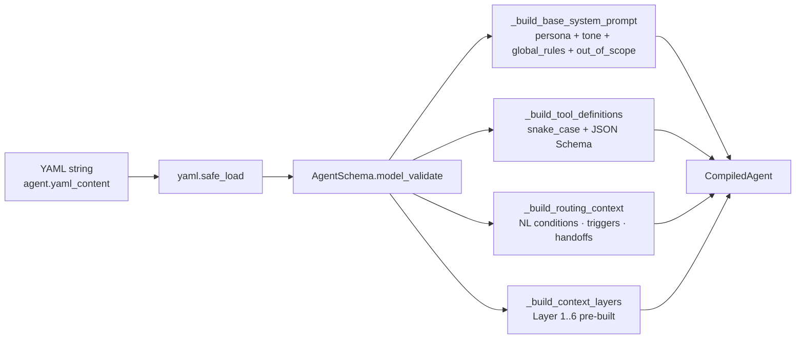

# Compiler

The compiler transforms a raw YAML agent definition into a `CompiledAgent` — a structured object the executor consumes each turn.

**Entry points:** [backend/saras/core/compiler.py](../../backend/saras/core/compiler.py)

```python
compile_from_yaml(yaml_content: str, agent_id="", agent_version="1.0.0") -> CompiledAgent
compile_schema(schema: AgentSchema, agent_id="", agent_version="1.0.0") -> CompiledAgent
```

The compiler is **pure and fast** — it never calls LLMs, never writes to the database, and never evaluates natural-language conditions. All of that happens at runtime in the [executor](executor.md).

---

## Pipeline



---

## System Prompt Assembly

`_build_base_system_prompt` produces Layer 1 content by concatenating these blocks **as coherent prose** (not a key/value dump):

1. **Persona** — verbatim from `persona`
2. **Communication style** — prefixed block of `tone`
3. **Always-follow rules** — bulleted list from `global_rules`
4. **Out-of-scope refusals** — bulleted list from `out_of_scope`

Interrupt trigger names and first-sentence descriptions are appended to Layer 1 at compile time so the model sees the full list of emergency overrides on every turn.

Goal sequences, slots, goal rules, and scoped tool guidance are **not** in the base prompt — they are injected per turn by the executor via [context layers](../concepts/context-layers.md).

---

## Tool Definition Builder

For each entry in `agent.tools`, the compiler emits a provider-agnostic `ToolDefinition`:

```json
{
  "name": "order_lookup",
  "description": "Retrieves order details by order ID. | On failure: Apologize and ask the user to check their confirmation email. | If no results: Tell the user no order was found and offer to escalate.",
  "input_schema": {
    "type": "object",
    "properties": {
      "order_identifier": {
        "type": "string",
        "description": "The order number the customer provided (e.g. ORD-12345)."
      }
    },
    "required": ["order_identifier"]
  }
}
```

Notes:

- `name` is `snake_case` (so it round-trips through Anthropic `tool_use` and OpenAI `function` calling).
- `on_failure` and `on_empty_result` are appended to `description` with a `|` separator so the model sees recovery guidance right inside the tool schema, not only in the system prompt.
- All inputs are `type: "string"` today. The input description carries any format hints.
- `required` is the list of input names where `required: true`.

---

## Routing Context Builder

`_build_routing_context` produces the natural-language blob sent to the router model each turn. Everything stays as strings — **never compiled to code**.

```python
RoutingContext(
    interrupt_triggers=[{name, description, action}],
    handoffs=[{name, description, target, context_to_pass}],
    conditions=[{name, description}],
    goals_by_condition={
        condition_name: [
            {name, description, has_slots, has_sequences, tool_names},
            ...
        ],
    },
)
```

The executor injects this into the router prompt (see [executor.py](../../backend/saras/core/executor.py) — `_build_router_prompt`) alongside slot registries, already-confirmed slots, and recent conversation turns.

---

## Context Layer Pre-Build

`_build_context_layers` walks every condition and goal once to pre-compute Layer 1 and templates for Layers 2–3, 5, 6. Layers 4 (slot fill), 7 (tool results), and 8 (memory) are filled inline at runtime.

Each layer is stored with a deterministic `label` so the executor can look it up by key:

| Layer | Label pattern | Built where |
|-------|---------------|-------------|
| 1 | `base` | Compile time, always present |
| 2 | `condition:<Condition Name>` | Compile time |
| 3 | `goal:<Condition>:<Goal>` | Compile time |
| 5 | `sequence:<Condition>:<Goal>:<Sequence>` | Compile time |
| 6 | `goal_rules_tools:<Condition>:<Goal>` | Compile time |
| 4, 7, 8 | — | Runtime (executor) |

See [Context Layers](../concepts/context-layers.md) for the full model.

---

## Validation

Structural checks are separate from compilation and live in [backend/saras/core/validator.py](../../backend/saras/core/validator.py). The validator runs 6 ERROR / 5 WARNING / 2 INFO rules:

- **ERROR** — undefined tool refs, unknown handoff targets, unknown sub-agent refs, required slots without `ask_if_missing`, required tool inputs without descriptions, agents with zero conditions.
- **WARNING** — unused tools, conditions with no goals, agents without any handoff, agents without interrupt triggers, very short personas.
- **INFO** — goals with rules but no sequence, conditions with ≥4 goals (consider splitting into sub-agents).

The frontend mirrors the most actionable rules in TypeScript for live feedback; the server is authoritative on every PATCH.

---

## Related

- [Agent Schema](agent-schema.md) — the input format
- [Executor](executor.md) — what consumes the `CompiledAgent`
- [Context Layers](../concepts/context-layers.md) — what the compiler pre-builds
