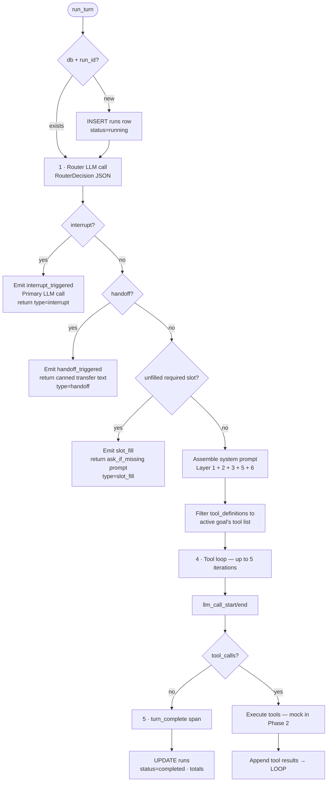

# Executor

The executor is the runtime core of Saras. It takes a `CompiledAgent` plus a conversation turn, assembles context, runs the LLM tool loop, persists every span, and emits real-time events.

**Entry point:** [backend/saras/core/executor.py](../../backend/saras/core/executor.py) → `run_turn(compiled, history, user_message, ...)`.

---

## Turn Lifecycle



---

## RouterDecision

Every turn starts with a dedicated **router** LLM call (uses `models.router` if configured, else falls back to `models.primary`). The router is prompted to return strict JSON:

| Field | Meaning |
|-------|---------|
| `interrupt_triggered` / `interrupt_action` | Name + action of the fired interrupt trigger, else null |
| `handoff_triggered` / `handoff_target` / `handoff_context` | Handoff metadata, else null |
| `active_condition`, `active_goal` | Selected condition + goal names (exact match into schema) |
| `sub_agent` | Sub-agent name when delegating |
| `unfilled_slots` | Required slot names that have no value anywhere in history or confirmed state |
| `extracted_slot_values` | Any slot values the router could infer from the entire conversation |
| `reasoning` | One-sentence rationale (for tracing) |

Two retries are budgeted for JSON parsing. On hard failure the executor emits `router_parse_error` and returns an empty decision (which collapses into the fallback path).

Accumulated slot state is merged **outside** the router — every extracted value goes into `current_slot_state`, and `unfilled_slots` is filtered against that state so confirmed slots are never re-asked.

---

## Slot Fill

If `unfilled_slots` is non-empty and there is an active goal, the executor short-circuits the primary LLM call:

1. Emit `slot_fill` span with the slot name.
2. Look up the slot's `ask_if_missing` prompt in the schema.
3. Return `TurnResult(type="slot_fill", content=question, ...)`.

This means slot fill never burns a primary model call — a deliberate cost/latency optimisation.

---

## Interrupts and Handoffs

Interrupts run a primary LLM call with an injected `EMERGENCY OVERRIDE — <trigger.name>: <trigger.action>` block replacing the regular goal context. The response is streamed back with `type=interrupt`.

Handoffs don't run a primary LLM call at all — the executor returns a canned transfer message (`"I'm transferring you to <target>..."`) with optional `context_to_pass` appended, and emits `handoff_triggered`.

---

## Tool Loop

When a routing decision resolves to an active goal:

1. Assemble the system prompt from relevant `ContextLayer`s:
   - **Layer 1** (base, always)
   - **Layer 2** (condition)
   - **Layer 3** (goal description + tone override)
   - **Layer 5** (every sequence in the active goal)
   - **Layer 6** (goal rules + scoped tool descriptions)
2. Filter `tool_definitions` to only those listed in `goal.tools` (if set).
3. Loop up to `MAX_TOOL_ITERATIONS = 5`:
   - Call `chat_completion(model=primary, messages, tools, temperature=0.3, max_tokens=2048)`.
   - If the response has no `tool_calls`, break with `final_content`.
   - Otherwise execute each tool, append tool results, iterate.
4. If the loop hits the cap, emit `tool_loop_exceeded` and return the last text the model produced (or a neutral fallback if none).

### Tool execution (Phase 2)

`_execute_tool` dispatches to deterministic **mock payloads** generated by Faker with a stable seed per `(tool.name, arguments)` pair:

- `LookupTool` → record-shaped object (orders, customers, products, payments, shipments, reservations, or a generic record based on tool-name keywords).
- `KnowledgeTool` → `{ query, result_count, results: [{title, snippet, source, score}] }`.
- `ActionTool` → success envelope with a typed id (`refund_id`, `ticket_id`, `confirmation_code`, …).

Phase 3 will replace this with real HTTP calls against `tool.endpoint`.

Errors from tool execution are caught; the model receives `{"error": ..., "tool": ...}` so it can recover gracefully, and a `tool_error` span is emitted.

---

## Span Events

Every sub-step emits a structured event on Redis channel `spans:{run_id}`. Span types written by the executor:

| `type` | Emitted when |
|--------|--------------|
| `router_start` | Before the router LLM call |
| `router_decision` | After the router returns; payload includes full `RouterDecision`, `slot_state`, the prompts used, and the raw user message |
| `router_parse_error` | On retry failure |
| `interrupt_triggered` | Interrupt branch taken |
| `handoff_triggered` | Handoff branch taken |
| `slot_fill` | Slot-fill short-circuit taken |
| `llm_call_start` / `llm_call_end` | Each primary-model iteration |
| `tool_call` / `tool_result` / `tool_error` | Per tool invocation |
| `tool_loop_exceeded` | Hit `MAX_TOOL_ITERATIONS` |
| `turn_complete` | Terminal — includes `duration_ms`, totals, `turn_type`, `content` |

The Simulator UI subscribes to this channel through the WebSocket and renders spans live on [LiveGraph](../../frontend/src/pages/simulator/LiveGraph.tsx).

---

## Persistence

When a session is provided:

- `Run` row is created up front (status `running`) so it can always reach a terminal state.
- Every `emit_span` call inserts a `Span` row with `type`, `name`, `payload` JSON, and optional `parent_span_id` for sub-agent trees.
- The `run` status is set to `completed`, `failed`, or `cancelled` in the wrapping try/except. `CancelledError` is handled separately so a mid-turn WebSocket drop never leaves a Run stuck in `running`.

Completed runs are fed into DuckDB by [tracing/collector.py](../../backend/saras/tracing/collector.py) for analytics aggregates.

---

## TurnResult

```python
class TurnResult(BaseModel):
    type: Literal["response", "slot_fill", "interrupt", "handoff"]
    content: str
    router_decision: RouterDecision | None
    tool_calls_made: list[dict]
    total_input_tokens: int
    total_output_tokens: int
    estimated_cost_usd: float
    run_id: str | None
    spans: list[dict]
    slot_state: dict[str, str]    # accumulated confirmed values for this session
```

`slot_state` is returned so the WebSocket layer can round-trip it into the next turn.

---

## Related

- [Compiler](compiler.md) — produces the `CompiledAgent` this consumes
- [Routing](../concepts/routing.md) — router prompt + slot-fill logic
- [Context Layers](../concepts/context-layers.md) — how the 8 layers are assembled
- [Multi-Agent](multi-agent.md) — sub-agent delegation via `parent_span_id`
