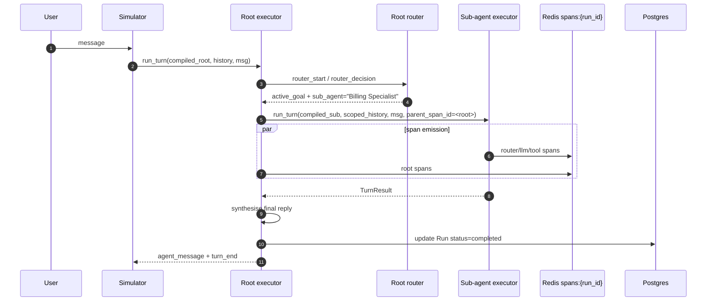

# Multi-Agent

Saras supports multi-agent systems where a **root agent** delegates to one or more **sub-agents**. From the user's perspective, the conversation remains a single coherent thread, but each sub-agent has its own persona, tools, goals, and rules.

---

## Schema

Sub-agents live at the root `AgentSchema` level. Each `SubAgent` entry must have **either** a `ref` (name of another agent in the same project) **or** an `inline` agent definition.

```yaml
agent:
  name: Orchestrator
  persona: >
    You coordinate specialist agents to answer customer questions end-to-end.

  conditions:
    - name: Billing Question
      description: The user has a billing, invoice, or payment question.
      goals:
        - name: Delegate to Billing
          description: Delegate to the Billing Specialist sub-agent.

  sub_agents:
    - name: Billing Specialist
      ref: Billing Specialist        # must match another Agent.name in this project

    - name: FAQ Bot
      inline:
        name: FAQ Bot
        persona: You answer common questions succinctly using the knowledge base.
        tools:
          - name: KB Search
            type: KnowledgeTool
            description: Searches the public knowledge base.
            source: kb
        conditions:
          - name: Anything
            description: The user asks a question.
            goals:
              - name: Answer
                description: Find the best KB article and summarise it.
                tools: [KB Search]
```

The router model decides which sub-agent to invoke based on the condition/goal description and the `sub_agent` field returned in its `RouterDecision`. No code is evaluated.

---

## Delegation Model


The root agent is responsible for:

- Selecting the right sub-agent via the router's NL evaluation
- Maintaining the global conversation context
- Synthesising the sub-agent's `TurnResult.content` before replying to the user

Sub-agents are full `AgentSchema` definitions — they bring their own tool catalogue, rules, and context layers.

---

## Execution Flow



---

## Span Attribution

Sub-agent spans share the same `run_id` as the parent but carry a `parent_span_id` pointing at the router span that dispatched them. The Traces UI groups them into a delegation tree using this relationship.

```python
await run_turn(
    compiled_sub,
    scoped_history,
    user_message,
    parent_span_id=root_router_span_id,
    run_id=run_id,
    db=session,
    redis_channel=redis_channel,
)
```

This is enough for the Traces detail view to render the full call tree per run.

---

## Context Handoff

The root does **not** pass its entire system prompt to the sub-agent. It passes:

- **Scoped conversation history** — last N turns (optionally summarised).
- **Active slots** from the root agent that are relevant to the sub-agent.
- **Routing reason** — the router's NL justification, so the sub-agent knows why it was invoked.

The sub-agent is compiled independently from its own YAML, so its Layer 1 (persona, tone, global rules, out-of-scope, interrupt triggers) is its own.

---

## Related

- [Executor](executor.md) — single-agent execution model
- [Routing](../concepts/routing.md) — how the router selects a sub-agent
- [Agent Schema](agent-schema.md) — `SubAgent` type reference
