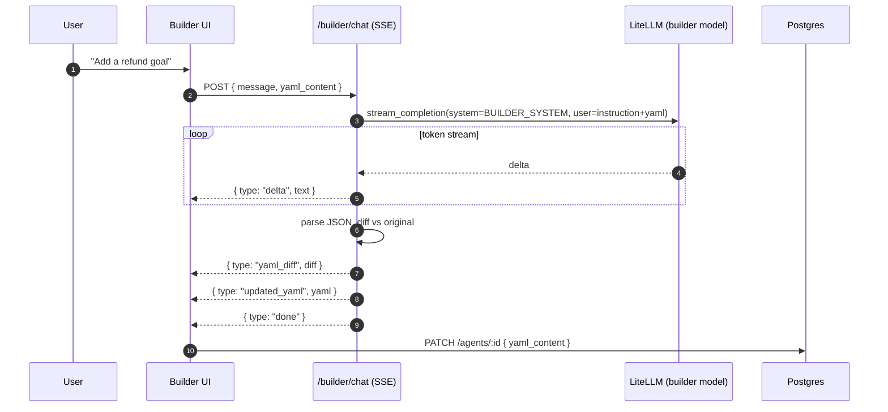
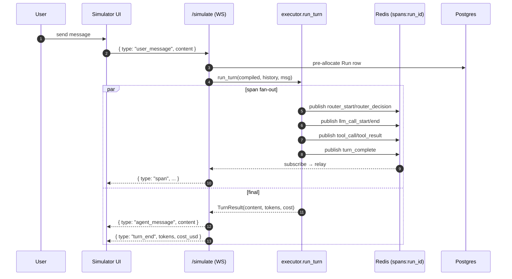
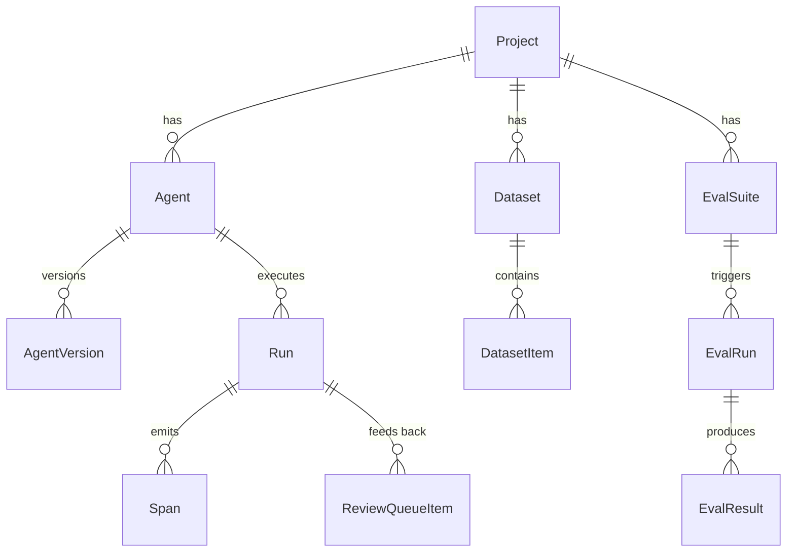

# Architecture Overview

Saras is a monorepo with two deployable packages — `backend/` (FastAPI + Python) and `frontend/` (React + Vite). They communicate over HTTP/WebSocket/SSE and share three data stores.

---

## System Diagram

---

## Component Responsibilities

| Component | Location | Responsibility |
|-----------|----------|----------------|
| **React Frontend** | [frontend/](../../frontend/) | Chat Builder, YAML editor, Outline + Form, Graph view, Simulator, Traces, Evals |
| **Builder API** | [backend/saras/api/builder.py](../../backend/saras/api/builder.py) | SSE endpoint that streams explanation deltas + full updated YAML |
| **Simulator API** | [backend/saras/api/simulator.py](../../backend/saras/api/simulator.py) | WebSocket session, Redis pub/sub fan-out for span events |
| **Agents API** | [backend/saras/api/agents.py](../../backend/saras/api/agents.py) | CRUD for agents + versions; stores `yaml_content` as source of truth |
| **Traces API** | [backend/saras/api/traces.py](../../backend/saras/api/traces.py) | Runs, sessions, spans, DuckDB analytics |
| **Evals API** | [backend/saras/api/evals.py](../../backend/saras/api/evals.py) | Suites, runs, per-item results, SSE progress stream |
| **Datasets API** | [backend/saras/api/datasets.py](../../backend/saras/api/datasets.py) | Datasets + items; powers eval inputs and review queue |
| **Samples API** | [backend/saras/api/samples.py](../../backend/saras/api/samples.py) | Pre-made agents + one-click clone |
| **Compiler** | [backend/saras/core/compiler.py](../../backend/saras/core/compiler.py) | YAML → `CompiledAgent` (system prompt, tool defs, routing context, context layers) |
| **Validator** | [backend/saras/core/validator.py](../../backend/saras/core/validator.py) | 6 ERROR + 5 WARNING + 2 INFO structural checks |
| **Executor** | [backend/saras/core/executor.py](../../backend/saras/core/executor.py) | Router → slot fill → primary LLM → tool loop; persists Run/Span; emits span events |
| **LiteLLM Adapter** | [backend/saras/providers/litellm.py](../../backend/saras/providers/litellm.py) | Unified chat + stream completion, token counting, cost estimation |
| **Tracing Collector** | [backend/saras/tracing/collector.py](../../backend/saras/tracing/collector.py) | Syncs completed Runs from Postgres into DuckDB for analytics |
| **Evals Engine** | [backend/saras/evals/](../../backend/saras/evals/) | Deterministic metrics, LLM judge, preset registry, async runner |
| **PostgreSQL** | Docker Compose | Projects, Agents, AgentVersions, Runs, Spans, Datasets, EvalSuites, EvalRuns, EvalResults, ReviewQueue |
| **Redis** | Docker Compose | Simulator span pub/sub (`spans:{run_id}`), session state, eval progress channels |
| **DuckDB** | Embedded (volume) | Analytics roll-ups on top of Postgres span data |

---

## Request Flow — Chat Builder

---

## Request Flow — Simulator

---

## Data Model (simplified)

Keys worth noting:

- `Agent.yaml_content` is the source of truth. `compiled_config` is a cached JSON dump of `CompiledAgent` for fast reads.
- `Run.session_id` groups multiple turns into a conversation session.
- `Span.type` discriminates event kinds: `router_start`, `router_decision`, `llm_call_start`, `llm_call_end`, `tool_call`, `tool_result`, `tool_error`, `slot_fill`, `interrupt_triggered`, `handoff_triggered`, `turn_complete`.

---

## Next Steps

- [Agent Schema](agent-schema.md) — the YAML format in detail
- [Compiler](compiler.md) — how YAML becomes a runnable agent
- [Executor](executor.md) — the tool loop and span lifecycle
- [Multi-Agent](multi-agent.md) — sub-agent delegation
