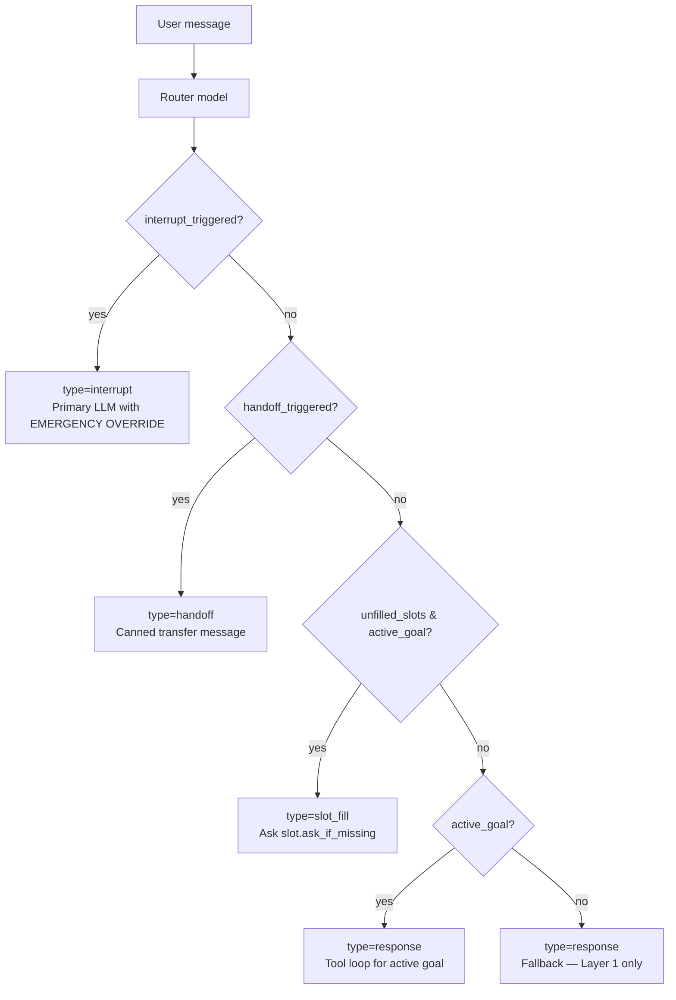

# Routing

Routing is the decision the executor makes at the start of every turn: which interrupt, handoff, or `(condition, goal)` pair should handle this message, and which slots are already known?

It is performed by a dedicated **router model** call — typically a small, fast model (`models.router`), separate from the primary reasoning model (`models.primary`).

---

## The Router Prompt

The router sees three kinds of input (built by `_build_router_prompt` in [executor.py](../../backend/saras/core/executor.py)):

1. **Routing configuration** — interrupt triggers, handoffs, conditions with nested goals, and per-goal slot definitions. All as natural language.
2. **Already-confirmed slot values** — session-scoped state accumulated across turns. The router is told to treat these as filled and never list them as unfilled.
3. **Recent conversation** — last 6 turns (role-labelled, truncated to 300 chars per message) plus the new user message.

It must return only strict JSON matching the `RouterDecision` schema. Two retries are budgeted on parse failure.

---

## RouterDecision

```python
class RouterDecision(BaseModel):
    interrupt_triggered: str | None
    interrupt_action: str | None
    handoff_triggered: str | None
    handoff_target: str | None
    handoff_context: str | None
    active_condition: str | None
    active_goal: str | None
    sub_agent: str | None
    unfilled_slots: list[str]
    extracted_slot_values: dict[str, str]
    reasoning: str | None
```

### Priority order



The executor enforces this priority explicitly — interrupts beat handoffs beat slot fill beat the tool loop.

---

## Condition Matching Is Natural Language

Conditions are written like:

```yaml
conditions:
  - name: Refund Requested
    description: >
      The user mentions a refund, return, money back, or says the order
      was damaged or wrong. Includes indirect phrasing like "I want to
      send this back" or "it's broken".
    goals: [...]
```

The router evaluates these against the conversation and picks the single best match. There is **no regex, no keyword list, no boolean logic** — the router model is trusted to reason about intent the same way it reasons about everything else.

Condition names are used verbatim as lookup keys — the router is told never to invent names.

---

## Slot Fill

Required slots have an `ask_if_missing` string. The router is asked to do two things with the full conversation, not just the latest message:

- **Extract** — pull slot values out of anything the user has said so far, including indirect phrasings (`"flying from Toronto to Paris"` → `Origin Airport=Toronto`, `Destination Airport=Paris`).
- **Report unfilled** — only list slots where the value genuinely can't be found in history or the confirmed state.

The executor then:

1. Merges `extracted_slot_values` into `current_slot_state` (accumulated confirmed values).
2. Filters `unfilled_slots` against `current_slot_state` — confirmed slots are never re-asked even if the router mistakenly lists them.
3. If anything is still unfilled, returns `TurnResult(type="slot_fill", content=slot.ask_if_missing)` — no primary LLM call.

`slot_state` is returned on the `TurnResult` so the WebSocket layer can round-trip it into the next turn.

---

## Interrupt Triggers

Interrupt triggers are checked **before** condition/goal selection. They are the escape hatch for high-priority situations that must preempt everything else — safety, crisis keywords, fraud signals, explicit cancellation requests.

```yaml
interrupt_triggers:
  - name: Crisis Signal
    description: >
      The user expresses self-harm, distress, or medical emergency.
    action: >
      Acknowledge calmly, share a crisis hotline, and transfer to a human.
```

When one fires, the executor:

1. Emits `interrupt_triggered`.
2. Replaces the goal stack with `EMERGENCY OVERRIDE — <name>: <action>`.
3. Runs a primary LLM call (no tools).
4. Returns `TurnResult(type="interrupt")`.

Slot state is preserved, so resuming the previous goal is possible on the next turn.

---

## Handoffs

Handoffs transfer the conversation to another agent in the project or to a human queue. The router returns `handoff_triggered` + `handoff_target` + `handoff_context`, and the executor emits a canned `"I'm transferring you to <target>..."` reply **without** a primary LLM call.

---

## Fallback

If no condition matches, `active_goal` is `null`. The executor still runs a primary LLM call, but only Layer 1 (base persona + tone + global rules) is in scope. No goal-specific sequences, no scoped tools, no slot fill. The agent responds in-character but without bespoke behaviour.

---

## Related

- [Executor](../architecture/executor.md) — where the router decision is consumed
- [Context Layers](context-layers.md) — what gets assembled once a condition + goal is chosen
- [Agent Schema](../architecture/agent-schema.md) — conditions, slots, interrupt triggers, handoffs
