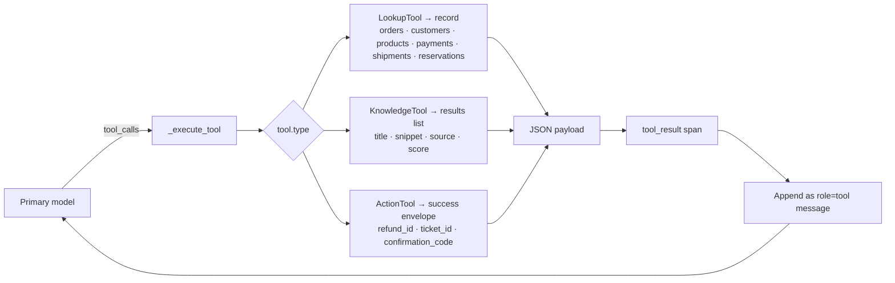

# Tools

Tools are the actions an agent can take — API calls, lookups, knowledge-base searches, writes. In Saras, tools are **defined once at the agent level** and **referenced by name** inside goals and sequences.

---

## Tool Definition

```yaml
tools:
  - name: Order Lookup                    # Human-readable, referenced by @tool:
    type: LookupTool                       # LookupTool · KnowledgeTool · ActionTool
    description: >
      Retrieves order details by the order identifier the customer provides.
    endpoint: https://api.acme.com/orders  # Phase 3 — real HTTP routing
    auth: acme_service_token
    inputs:
      - name: Order Identifier
        description: The order number (e.g. ORD-12345) as given by the customer.
        required: true
      - name: Include History
        description: Whether to include shipment history. Defaults to false.
        required: false
    on_failure: >
      Apologize and ask the user to double-check the order number on their
      confirmation email.
    on_empty_result: >
      Tell the user no order was found and offer to transfer to a human.
```

### Fields

| Field | Applies to | Description |
|-------|-----------|-------------|
| `name` | all | Unique, human-readable. Referenced as `@tool: <name>` in sequences and in goal `tools:` lists. |
| `type` | all | One of `LookupTool`, `KnowledgeTool`, `ActionTool`. Drives mock payload shape in Phase 2. |
| `description` | all | What the tool does. Shown to the LLM in the tool schema. |
| `endpoint`, `auth` | Lookup / Action | Real HTTP target and auth reference (wired up in Phase 3). |
| `source`, `collection` | Knowledge | Index or collection to search. |
| `confirmation_required` | Action | If true, the agent should confirm with the user before invoking. |
| `inputs` | all | List of `{name, description, required}`. |
| `on_failure` | all | Natural-language recovery instruction when the tool errors. |
| `on_empty_result` | all | Natural-language instruction when the tool returns nothing. |

---

## Referencing Tools in Sequences

Tools are invoked inside goal sequences using `@tool: Tool Name`:

```yaml
goals:
  - name: Handle Refund Request
    sequences:
      - name: Verify and refund
        steps:
          - Acknowledge the refund request warmly.
          - You MUST invoke @tool: Order Lookup to verify the order exists.
          - Confirm the order details with the user before proceeding.
          - You MUST invoke @tool: Submit Refund with the confirmed order ID.
          - Confirm the refund has been submitted and give the user a timeline.
    tools:
      - Order Lookup
      - Submit Refund
```

The `You MUST invoke` phrasing is intentional — it signals a hard requirement, not a suggestion.

The `goal.tools` list is used by the executor to **scope tool availability**: only tools listed there are passed to the primary LLM for this turn. If `goal.tools` is empty, all agent-level tools are available.

---

## Compiled Tool Schema

The compiler turns each `AgentTool` into a provider-agnostic `ToolDefinition`:

```json
{
  "name": "order_lookup",
  "description": "Retrieves order details by the order identifier the customer provides. | On failure: Apologize and ask the user to double-check the order number... | If no results: Tell the user no order was found and offer to transfer to a human.",
  "input_schema": {
    "type": "object",
    "properties": {
      "order_identifier": {
        "type": "string",
        "description": "The order number (e.g. ORD-12345) as given by the customer."
      },
      "include_history": {
        "type": "string",
        "description": "Whether to include shipment history. Defaults to false."
      }
    },
    "required": ["order_identifier"]
  }
}
```

Notes:

- `name` is `snake_case`d for LLM compatibility.
- `on_failure` and `on_empty_result` are appended to `description` with a `|` separator so the model sees recovery guidance every time it considers calling the tool, not only in the system prompt.
- All inputs are modelled as `string`; put format hints in the description.
- `required` lists inputs where `required: true`.

---

## Tool Execution



Phase 2 uses **deterministic Faker-backed mocks** seeded from `(tool.name, arguments)` so repeated calls return the same payload — useful for testing and for the simulator. Phase 3 will route to `tool.endpoint` via HTTP.

Errors are caught and fed to the model as `{"error": ..., "tool": ...}` so it can recover gracefully. A `tool_error` span is emitted in that case.

The tool loop is capped at `MAX_TOOL_ITERATIONS = 5` per turn. If the cap is hit, the executor emits `tool_loop_exceeded` and returns the last text the model produced.

---

## Tool Scoping

By default a tool defined at the agent level is available to **all goals**. To restrict it:

```yaml
goals:
  - name: Handle Refund Request
    tools:
      - Submit Refund       # only callable within this goal
```

The executor filters `tool_definitions` down to this list before making the primary LLM call.

---

## Related

- [Agent Schema](../architecture/agent-schema.md) — the full `AgentTool` reference
- [Compiler](../architecture/compiler.md) — how tools become LLM-compatible schemas
- [Executor](../architecture/executor.md) — how the tool loop runs
